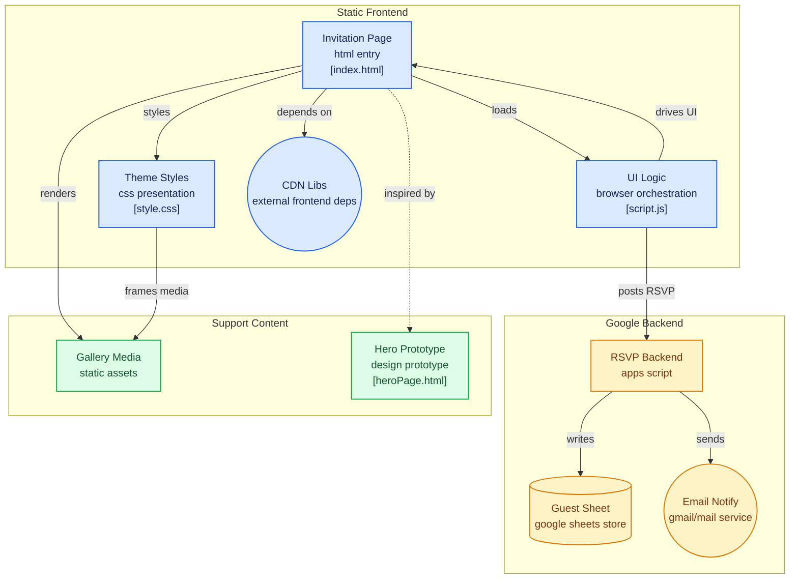

# Wedding Invitation SPA with RSVP Form

A beautiful, responsive single-page application for wedding invitations with an integrated RSVP form that saves responses to Google Sheets and sends email notifications.

## Features

- **Beautiful Design**: Elegant wedding-themed design with smooth animations
- **Responsive**: Works perfectly on desktop, tablet, and mobile devices
- **RSVP Form**: Complete form with validation and Google Sheets integration
- **Countdown Timer**: Live countdown to the wedding date
- **Email Notifications**: Automatic email alerts for new RSVPs
- **Smooth Scrolling**: Seamless navigation between sections
- **Form Validation**: Client-side validation with helpful error messages

## Setup Instructions

### 1. Google Sheets Setup

1. Create a new Google Sheet
2. Copy the Sheet ID from the URL (the long string between `/d/` and `/edit`)
3. Go to Extensions → Apps Script
4. Replace the default code with the contents of `Code.gs`
5. Update the `SHEET_ID` variable with your Sheet ID
6. Update the email address in the `sendEmail` function
7. Save and deploy as a web app:
   - Click "Deploy" → "New deployment"
   - Choose "Web app" as type
   - Set execute as "Me" and access to "Anyone"
   - Copy the web app URL

### 2. Website Setup

1. Update `script.js` with your Google Apps Script web app URL
2. Customize the wedding details in `index.html`:
   - Names of the couple
   - Wedding date and time
   - Venue information
   - Contact email

### 3. Customization

#### Wedding Details
Edit these sections in `index.html`:
- Hero section: Names, date, location
- Story section: Your love story
- Details section: Venue, timing, dress code
- Footer: Contact information

#### Styling
Modify `style.css` to change:
- Color scheme (search for `#8B4513` and `#DEB887`)
- Fonts (currently using Playfair Display and Dancing Script)
- Background images

#### Countdown Timer
Update the wedding date in `script.js`:
```javascript
const weddingDate = new Date("Aug 15, 2025 16:00:00").getTime();
```

## File Structure

```
wedding_RSVP/
├── index.html          # Main HTML file
├── style.css           # Stylesheet
├── script.js           # JavaScript functionality
├── Code.gs             # Google Apps Script code
└── README.md           # This file
```

## Dependencies

- Bootstrap 5.3.0 (CDN)
- jQuery 3.6.0 (CDN)
- Google Fonts (Dancing Script, Playfair Display)
- Font Awesome (for icons)

## Browser Support

- Chrome (latest)
- Firefox (latest)
- Safari (latest)
- Edge (latest)
- Mobile browsers

## Features Breakdown

### RSVP Form Fields
- **Name**: Required text field
- **Email**: Required email field with validation
- **Attendance**: Required dropdown (Yes/No)
- **Number of Guests**: Dropdown selection
- **Dietary Restrictions**: Optional text field
- **Song Request**: Optional text field
- **Special Message**: Optional textarea

### Google Sheets Integration
- Automatic timestamp for each submission
- Formatted data storage with headers
- Auto-resize columns for readability
- Email notifications with HTML formatting

### Responsive Design
- Mobile-first approach
- Flexible grid system
- Touch-friendly interface
- Optimized images and fonts

## Customization Tips

1. **Colors**: The main color scheme uses brown tones (`#8B4513`, `#DEB887`). Search and replace these in `style.css` to change the theme.

2. **Background Image**: Replace the hero background image URL in `style.css`:
   ```css
   background: url('your-image-url-here');
   ```

3. **Content**: Update all text content in `index.html` to match your wedding details.

4. **Form Fields**: Add or remove form fields by:
   - Updating the HTML in `index.html`
   - Adding validation in `script.js`
   - Updating the Google Sheets headers in `Code.gs`

## Deployment

### Option 1: GitHub Pages
1. Push your code to a GitHub repository
2. Enable GitHub Pages in repository settings
3. Your site will be available at `https://username.github.io/repository-name`

### Option 2: Netlify
1. Connect your GitHub repository to Netlify
2. Deploy automatically with each push
3. Custom domain support available

### Option 3: Traditional Web Hosting
1. Upload all files to your web hosting provider
2. Ensure the domain points to the correct directory

## Security Considerations

- The Google Apps Script URL is public but only accepts the specific form data
- Consider adding a simple invite code system if you want additional security
- Email addresses are validated on both client and server side

## Troubleshooting

### Form Not Submitting
1. Check that the Google Apps Script URL is correct
2. Ensure the Google Sheet is accessible
3. Verify the deployment settings in Google Apps Script

### Email Notifications Not Working
1. Check that Gmail API permissions are granted
2. Verify the recipient email address
3. Check Google Apps Script logs for errors

### Styling Issues
1. Ensure all CSS files are properly linked
2. Check browser developer tools for CSS conflicts
3. Verify that external font and icon libraries are loading

## Future Enhancements

- [ ] Admin dashboard for viewing responses
- [ ] Integration with calendar systems
- [ ] Photo gallery section
- [ ] Gift registry integration
- [ ] Guest messaging system
- [ ] QR code for easy mobile access

## Support

If you encounter any issues:
1. Check the browser console for JavaScript errors
2. Review Google Apps Script logs
3. Ensure all external dependencies are loading correctly

## License

This project is open source and available under the MIT License.

---

*Made with ❤️ for your special day*


